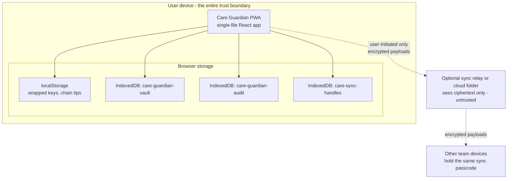
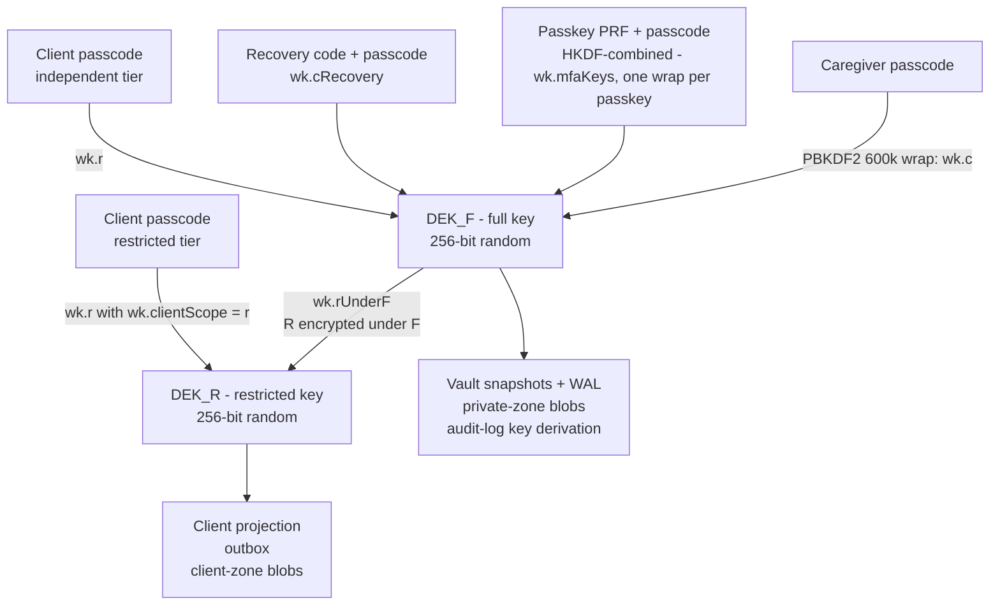
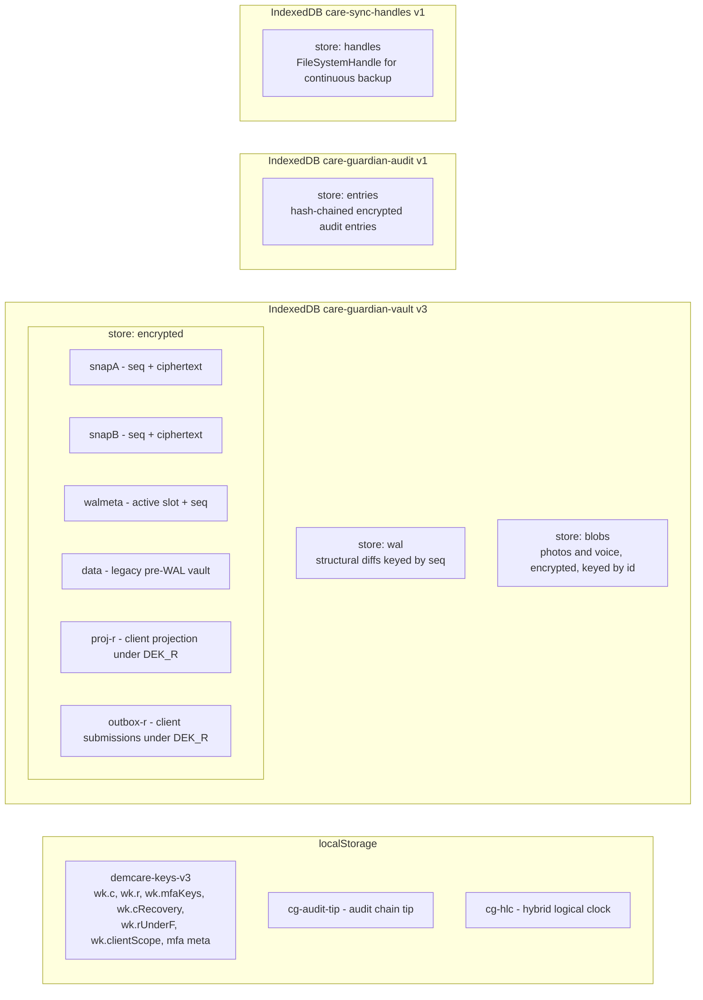
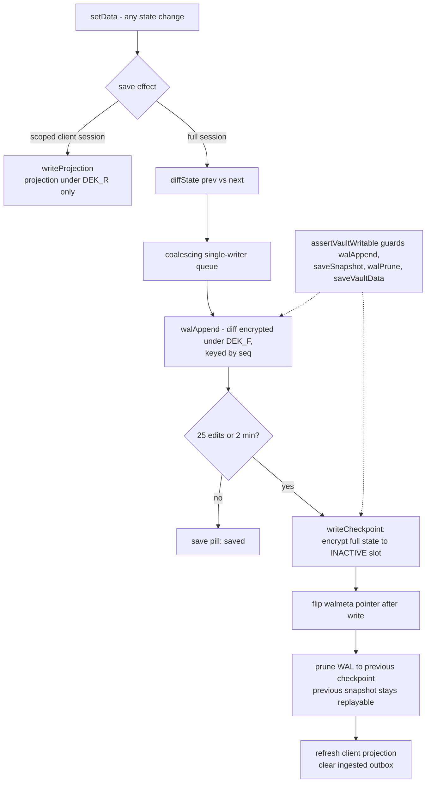
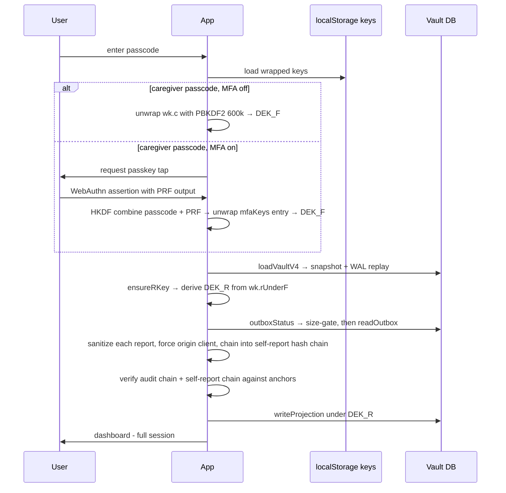
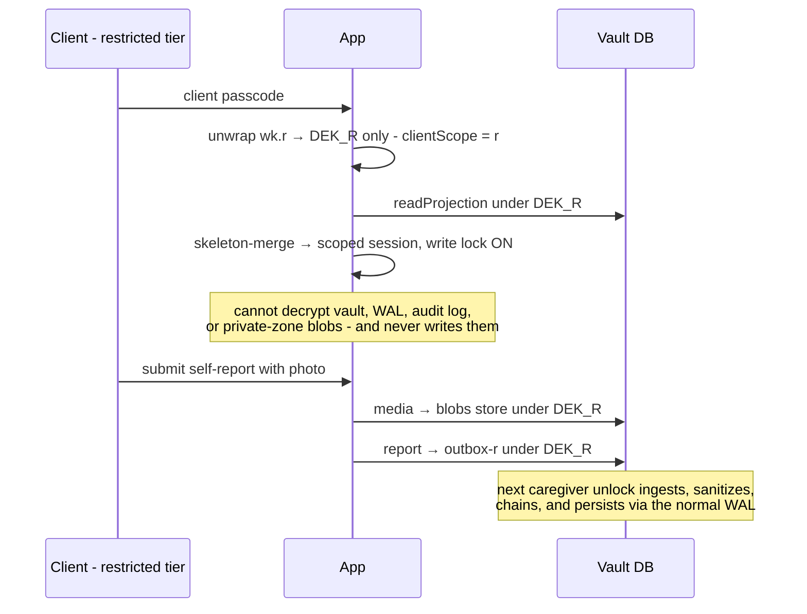
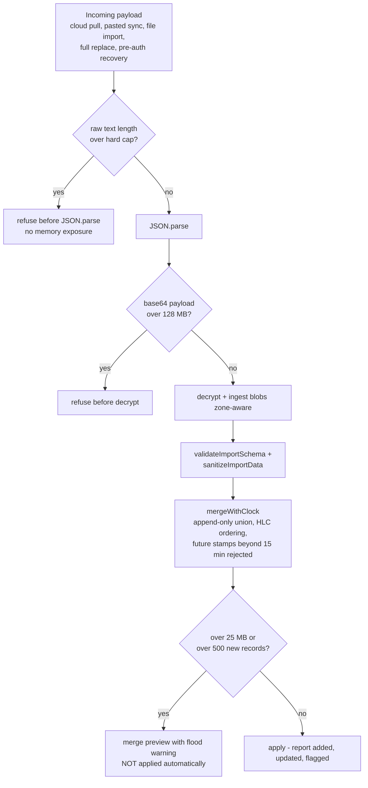
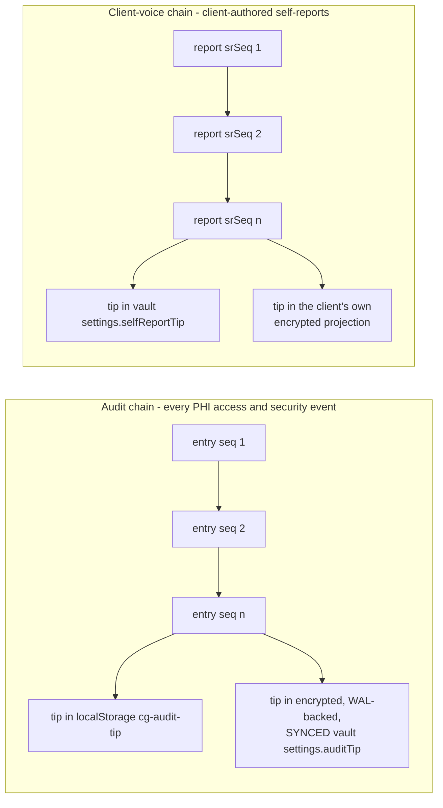

# Care Guardian — Architecture

This document describes the architecture as implemented in `dashboard.jsx` (single-file React application, ~6,100 lines). Every store name, key name, and flow below is taken from the code, not from design intent. Diagrams are Mermaid and render on GitHub.

## 1. System Context

Care Guardian is a local-first progressive web app. There is no server in the trust boundary: all data lives in the browser, all cryptography is client-side Web Crypto, and the only network activity is user-initiated sync of ciphertext to a destination the user chooses. The optional relay stores opaque encrypted payloads and is treated as untrusted.

The app makes zero network requests on its own: fonts and pdf.js are bundled, there is no telemetry, and the service worker serves only same-origin assets. Sync, import, and export are explicit user actions.

## 2. Key Hierarchy

Two data-encryption keys exist. `DEK_F` (full) encrypts everything private; `DEK_R` (restricted) encrypts the client-visible projection and outbox. `DEK_R` is stored wrapped under `DEK_F`, so every path that recovers the full key derives the restricted key — strictly one-way. All wraps use PBKDF2-SHA-256 at 600,000 iterations and AES-256-GCM with a fresh random 96-bit IV per operation.

When MFA is enabled the passcode-only caregiver wrap is removed; the vault key is then recoverable only through passcode-plus-passkey or passcode-plus-recovery-code, and a second passkey can replace the recovery code entirely. Enrollment verifies the new factors round-trip to the exact key before removing the old wrap, so a failed setup can never cause lockout.

## 3. Storage Layout

The vault is a single JSON document encrypted as a whole. Binary media never enter it: photos and voice notes live in the `blobs` store encrypted under the zone key of their owning record, with only `blobref:<id>` strings inline, which keeps snapshots, WAL diffs, and per-save encryption small.

## 4. Save Pipeline — Write-Ahead Log

Every state change flows through one effect. Full sessions append a structural diff to the WAL; periodic checkpoints write complete snapshots into an A/B slot pair with write-then-flip-pointer semantics, so a crash at any moment leaves a valid snapshot plus a replayable log. Scoped client sessions never touch any of this — a module-level write lock makes the storage primitives themselves refuse.

Load is the inverse: take the active snapshot (falling back to the other slot, then the legacy `data` key), then replay WAL entries with seq greater than the snapshot's. The diff/apply/replay core is proven by 200,000-plus round-trips and a crash/corruption pipeline simulation in `tests/`.

## 5. Unlock Flows

A client-restricted unlock is a different path entirely: the client wrap yields only `DEK_R`, the session decrypts just the projection, merges it over an empty skeleton so views degrade gracefully, and sets the hard write lock. A legacy client wrap that still holds the full key is permanently downgraded to `DEK_R` on its first post-migration sign-in.

## 6. Sync and Import Ingress — Circuit Breakers

All five ingress paths share the same layered gates. Nothing is parsed before a raw-size check, nothing is applied before validation and sanitization, and an unusually large update is quarantined for explicit review instead of auto-merged.

Scoped client sessions are refused at the entry of every one of these functions, independent of UI gating. The encrypted outbox gets the same treatment in miniature: its ciphertext size is checked before any decrypt, and each report passes a strict field whitelist that caps sizes and strips chain and origin fields.

## 7. Integrity Chains

Two independent hash chains provide tamper-evidence, both using sequence number, previous-hash link, and a SHA-256 over canonical content, both anchored where an attacker would also have to win.

Client-authored reports are additionally append-only at the application level — no role, including admin, has a delete or edit path — and each report's hash covers fingerprints of its attached media, so swapping a photo is as detectable as editing text. The honest limit, stated in every relevant document: a holder of the full key who controls the device can recompute either chain; this is tamper-evidence against realistic manipulation, not non-repudiation.

## 8. Code Organization

The application is deliberately a single file, organized in layers that the line ranges below approximate: state-content definitions (domains, Oregon Medicaid content, emergency scenarios), then the cryptographic and storage core (key wrapping, vault DB, WAL, blobs, projection and outbox, integrity chains, circuit breakers — all module-level pure-ish async functions), then the React component (state hooks, the save effect, unlock and session lifecycle, feature views), then embedded CSS. The module-level core is what the eleven isolated test suites in `tests/` exercise: they import or replicate those functions verbatim and prove the safety-critical invariants — WAL round-trips and crash simulation, both hash chains, the HLC, MFA factor combination, blob round-trips across keys, garbage-collection safety, zone scoping, outbox hardening, and the flood-breaker thresholds. CI runs all of them on every push.

The single-file constraint trades modularity for auditability — one artifact, one hash, nothing hidden in a dependency graph. The architecture review (SECURITY-AUDIT-v8.md) flags ~7,000 lines as the point to revisit that trade by splitting the crypto/storage/merge core into separately audited modules.
